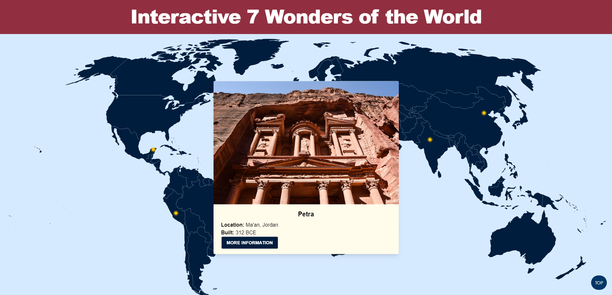

# Interactive 7 Wonders of the World
**Developed By Group 5:** Cyrus Esfahani, Grace Kewanimptewa, Daniel Olaes

An interactive map of the 7 Wonders of the World. Hovering over the different location pins on the world map will cause a pop-up window to appear with a little information about the corresponding Wonder of the World. If the user want to read more about the Wonder, they can also click on a "Learn More" button to navigate to a specific section with more information. In addition, the user will be able to fill out a checklist to mark which Wonders they would/have visited.

## Screenshots

## Technology Used
**Developed Using:** HTML, CSS, JavaScript, TailwindCSS, Swiper

## 🔗 Links
**GitHub Repository:** https://github.com/dolaes/Interactive-7-Wonders

**GitHub Deployment:** https://dolaes.github.io/Interactive-7-Wonders/

**Figma Jam Board:** https://www.figma.com/board/Z1JwgbB6OpSMKcv9W63lWE/Project-1-Ideation?node-id=0-1&t=fxnVT32wPDlN54w0-1

**Figma Wireframe:** https://www.figma.com/design/ULtthZFmdklGxhRCgOA0vi/Project-1?node-id=46-4&m=dev&t=A1zIZWAqqKaYHPmT-1
